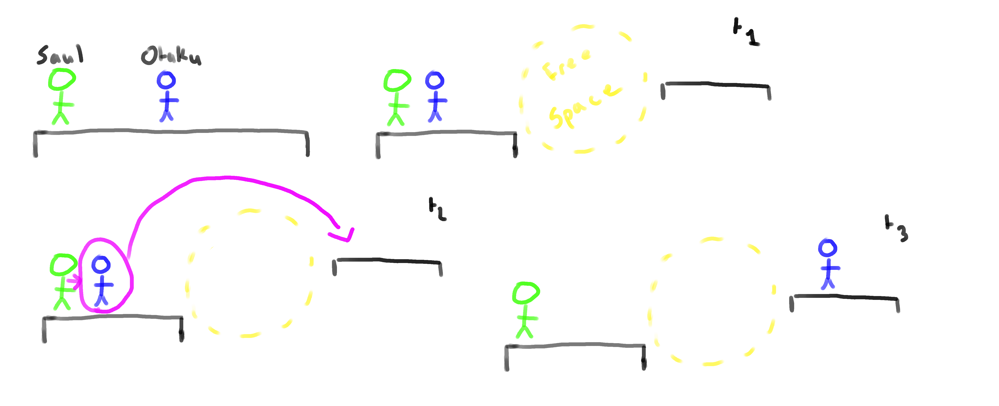
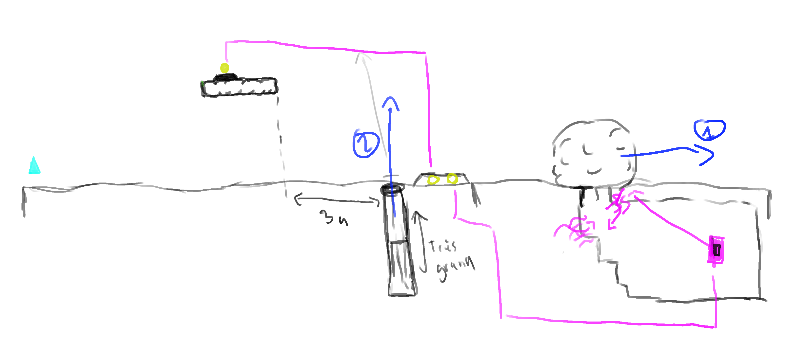

<footer style='page-break-after : always'>
   Florian Desrousseaux -
    François Duport -
    Marion Pellicer -
    Pablo Bourdelas
</footer>

# Vue d'ensemble du Jeu
## Présentation

Doreimi est un jeu en temps réel de plateforme fonctionnant avec des énigmes. Le joueur controlera son personnage (Yhdol) qui placera et donnera des ordres à ses subordonnés pour évoluer dans l'histoire. C'est un jeu avec un contexte musical important qui sert à rendre agréable l'immersion du joueur dans le jeu.

## Genre

Jeu de plateforme et d'énigmes
Niveaux en 2D

## Audience ciblée

Les joueurs occasionnels représentent la cible principale du jeu.

## Apparence et ambiance

L'environnement global du jeu regroupera deux ambiances :
- Une ambiance haute en couleur et dynamique par moments
- Une ambiance un peu plus sombre et intimidante à d'autres moments

Il y a également une ambiance musicale importante du fait de l'histoire du jeu qui collera avec les niveaux.

Le style du jeu seras en style pixel-art.

# Gameplay et Mécaniques
## Gameplay
#### Game Progression

Le jeux est découpé en différent tableaux.

La progression générale dans le jeu s'effectue en finisant une suite de tableaux.

Les tableaux sont présentés dans un ordre définit à l'avance.

Le joueur ne peut pas passer un tableau, et doit oblitoirement finir un tableau pour passer au suivant.

#### Structure des Missions/Challenges

Chaque niveau est une nouvelle énigme à résoudre.
Tous les challenges se passent sur des tableaux 2D au background toujours différent pour instaurer à chaque fois une nouvelle ambiance.

Au fur et à mesure du jeu, les énigmes seront de plus en plus complexes tout en gardant une évolution de la difficulté raisonnable pour ne pas décourager trop rapidement les joueurs.

Le jeu est divisé en étape dont le franchissement parfait est représenté par l'apparition d'une phase de concert qu'elle donne au Cosmic Nihon Festival.

Pour chaque tableau on donne au joueur un nombre définit à l'avance d'otaku pour résoudre l'énigme.
Le but est d'atteindre la zone de sortie, avec Yhdol.

La zone de sortie nécessite l'activation d'un ou plusieurs interrupteur pour pouvoir être utilisable.

L'utilisation, déplacement d'objet ou l'activation d'interrupteur (plaque/bouton et dispositif similaire) permet le déclanchement d'événements modifiant les posibilités de déplacement dans le tableau. Cela se matérialise par des murs escamotable et des dispositifs de portes.

#### Objectifs

L'objectif principal du jeu est d'accompagner notre héroïne Yhdol tout au long de son voyage au Canada durant la tournée de la Cosmic Nihon Festival.

Pour se faire, elle devra traverser d'immenses paysages et résoudre des casses-têtes afin d'avancer dans le monde et à chaque étape arriver à l'heure à son concert.

L'objectif d'un tableau est d'atteindre la zone de sortie active.
Si la zone de sortie n'est pas active il faut l'activer à l'aide des d'interrupteurs indiqués dans le tableau.

## Mécaniques

La mécanique du jeu consiste à contrôler Ydhol et ses otakus en les placant et en leur donnant des ordres.

#### Physique

Le jeu utilise une physique dite réaliste sauf en ce qui concerne les actions spéciales des otakus.

#### Déplacements et mouvements

La taille d'Ydhol est de 1.5 unité de haut par 0.3 u de large.

Ydhol peut se déplacer vers la gauche et vers la droite.
On dipose d'un saut d'une distance maximal de 2 unités à l'horizontal et 2 unités à la vertical.

Yhdol subit la gravité, le valeur de cette force est 1 g dirigé vers le bas.

#### Objets

Tout les objets subissent la gravité à valeur de 1g par default vers le bas de l'écran.

Lourds : Caisses et rochers.
Légers : Clés, sacs pleins.

Les interrupteurs de type bouton ne peuvent être activé que par Ydhol.

Les interrupteurs de type plaque peuvent être activé par Ydhol, un Rei
portant un objet, ou un objet lourd placé dessus.

#### Actions

Chaque type d'otaku à une capacité spéciale.

Le Doh peut pousser des objets lourds ainsi que les maintenir, et se déplacer latéralement.

Le Rei peut porter des petits objets, et se déplacer latéralement.

Le Mie peut téléporter Yhdol près de n'importe quel Pha mais ne peut pas se déplacer. Il ne sert à rien si aucun Pha n'est placé.
Le Pha sert de balise pour la téléportation d'Yhdol par un Mie. Il ne peut pas se déplacer.

Le Saul peut lancer un otaku, et se déplacer latéralement. Le lancer est possible
si on dispose d'une ligne droite sans obstacle entre l'origine et la cible.

Le La peut créer des courants d'airs poussant les personnages et les objets légérs, et se déplacer latéralement.
La force créée par le courant d'air est de 0.8g (La force ne doit pas permettre de pouvoir voler ou léviter).

Le Xi peut se spécialiser pour utiliser la capacité de n'importe quel autre otaku. Une fois la spécialisation choisie, elle est définitive.

## Replay et Sauvegarde

Les sauvegardes sont automatiques et s'effectuent à chaque fin de niveau. Compléter un niveau sauvegarde la progression du joueur automatiquement et ce dernier ne peut en aucun cas sauvegarder sa partie en plein milieu d'un niveau.

# Histoire, Cadre et Personnages
## Histoire

Dans un monde où l'univers de l'animation japonaise fascine de plus en plus les gens, le Québec décide d'organiser le Cosmic Nihon Festival.

Alors qu'elle compte se rendre là-bas en tant qu'invitée d'honneur, la jeune star de la J-pop Yhdol se retrouve perdue au milieu de la forêt québecoise après un crash d'avion.

Elle va devoir se débrouiller pour se rendre à temps au festival, en sollicitant l'aide de ses nombreux fans qu'elle pourra rencontrer au cours de son périple. Yhdol rencontrera plusieurs types d'Otakus : les Doh, les Rei, les Mie, les Pha, les Saul, les La et les Xi.

## Le monde du jeu
#### Ambiance et apparence globale du jeu

L'environnement global du jeu regroupera deux ambiances :
- Une ambiance haute en couleur et dynamique par moments
- Une ambiance un peu plus sombre et intimidante à d'autres moments

L'apparence globale du jeu se rapprochera beaucoup du style manga afin d'accentuer l'aspect nippon du jeu. Les couleurs auront une place importante dans la compréhension de l'ambiance qui règne dans les lieux que visite notre jeune star. L'ambiance sonore sera également beaucoup utilisée pour plonger le joueur dans un état proche de celui que doit ressentir le personnage dans le niveau actuellement chargé.

#### Zones

Notre héroïne se déplaçant au coeur du Canada, de nombreux background du jeu seront des paysages atypiques et uniques que l'on ne peut voir que dans ce pays. De plus, une part de magie pourra y être insérée pour donner un aspect très fantasy à ce monde et augmenter les contrastes qui peuvent exister entre les différentes zones traversées par Yhdol. On pourra par exemple passer d'un niveau dans la sombre forêt avec des animaux hostiles en fond à un monde de plaines qui nous sépare du désert beaucoup plus calme et moins effrayant pour la jeune femme.

De plus, il y aura également des niveaux en fin de stage qui se passeront dans un milieu plus urbain et peuplé qui désigneront les phases de concerts qui constituent le Cosmic Nihon Festival.

## Personnages

Pour les personnages nous auront Yhdol, le personnage incarné par le joueur. Cette jeune star de la J-Pop est venue participer à la Cosmic Nihon Festival qui se déroule cette année au Canada. Cependant un crash d'avion va la mener à traverser tout le pays à pieds et elle pourra demander l'aide des otakus qu'elle rencontrera sur son chemin.

De plus, il y aura 7 types d'otakus différents dans le jeu qui seront là pour aider Yhdol à résoudre les énigmes et à avancer jusqu'à son point de rendez-vous où elle chantera pour ses fans.

# Niveaux
## Tableau 1
Voici un schéma du premier niveau

Le rocher (1) n'est soumis à aucune force de rappel.
Le fossé (2) est profond de 3 unité pour 3 de largeur.
La plateforme (3) est placée de sorte à ce qu'un otaku puisse y être envoyé.
La zone de fin (4) est placée après un fossé infiniment profond de 4 unités de large.

Le joueur dispose de :
- 1 Doh
- 1 Rei
- 1 Mie
- 1 Pha
- 1 Saul
- 1 La

## Tableau 2
Voici un schéma du second niveau

Lorsque le joueur pousse le rocher à l'aide d'un Doh (1) le mur (2) se lève. Si le joueur relache la pierre elle revient en place et le mur rentre dans la terre.
La zone de sortie (plaque avec 2 ronds jaunes) à besoin d'avoir 2 interrupteur activés (suivre trait violet).
Si l'interrupteur en sous-sol est activé la sortie de la caverne se bloque, si on le désactive elle se débloque.

La plateforme avec l'autre interrupteur est située à environ 2.5/3 unité du bord du haut du mur.

Pour résoudre cette énigme le joueur dispose de :
- 1 Doh
- 1 Mie
- 1 Pha
- 1 La

# Interface
## Ecrans et Menus
#### Ecran de jeu et Camera

La camera capture tout le tableau si sa largueur est inférieure à 30 unité, sinon on effectue un scrolling. Le tableau est toujours affiché sur toute sa hauteur.

Les otakus disponibles sont représentés par des bulles suivant Ydhol. Le type d'otaku actuellement selectionné est rendu par une bulle plus grande.

#### Menu Principal
_CONTINUER LA PARTIE_  
Lance la partie à partir du dernier niveau terminé. S'il n'y a aucune sauvegarde présente dans la mémoire du jeu, l'option est remplacée par _NOUVELLE PARTIE_  

_JOUER_  
Fait apparaitre deux sous-options à l'écran :  
- NOUVELLE PARTIE  
Recommence le jeu depuis le début en supprimant la progression  
- CHOIX DU NIVEAU
Ouvre le Menu de choix de niveau  

_QUITTER_  
Termine l'exécution du jeu  

#### Menu de Choix de niveau
Affiche la liste des niveaux débloqués

_RETOUR_  
Retourne au menu principal  

#### Menu Pause
Accessible via la touche "Echap"  

_SON ON/OFF_  
Active ou désactive le son du jeu  

_QUITTER LE NIVEAU_  
Retourne au menu principal  

_RETOUR_  
Retourne au jeu  
Equivalent à appuyer sur la touche "Echap"  

## Contrôles
#### Dans les menus

Pour choisir les différentes options présentes dans les menus, le joueur utilisera sa souris. Il pourra pointer sur l'option souhaitée et valider sa sélection en cliquant. Il pourra aussi utiliser la touche "Echap" pour retourner à l'écran précédent.

#### En jeu

Durant les parties, le joueur devra contrôler à la fois Yhdol et les Otakus.

Les contrôles seront configurable. Les contrôles par défaut sont font au clavier souris. Le joueur pourra aussi configurer une manette.

Les contrôles on 3 modes :
  - Le Mode Classic
  - Le Mode J : Le mode de selection des otakus positionés
  - Le Mode Contextuelle : Ce mode est propre aux capacités d'un otaku.

Les contrôles par défaut proposés seront :

Au clavier selon la disposition :
  - En local dite AZERTY : Z Saut, Q mouvement droit, D mouvement Gauche.
  - En local dite QWERTY : W Saut, A mouvement droit, D mouvement Gauche.

par default sans prendre en compte la disposition :
  - I : Quiter le controle d'otaku. Les commandes de mouvement retourne à Ydhol.
  - O "Bouton d'action" : Actionner un interrupteur bouton (Ydhol).

 Effectuer l'action de type (Otaku).

 Mode J sélectionner l'otaku courant.

 (La) Maintenir pour changer la direction du courant a l'aide des touches de mouvement.

  - J : Mode de selection otaku placés. (Mode J)
  - V : Placer un otaku
  - C : Retirer un otaku
  - K,L : monter, descendre dans la liste de type otaku. En Mode J, parcourir les otaku.
  Mode Mie parcourir les Pha.
  - 1-7 : Selection rapide des types otaku

 Alternativement le joueur pourra aussi utiliser la souris pour les action suivante :
 - selectioner l'otaku à controler : pointeur de la souris.
 - Parcourir la liste de type d'otaku : molette de la souris.

La touche "Echap" permettra d'afficher le menu de Pause.

## Audio, musique, effets audios

#### Musique de fond

Dans chaque niveau, une musique sera jouée. Elle sera en lien avec l'ambiance du niveau et sera utilisée pour accentuer l'immersion.

<table id="table_music">
<tr><td>Moments</td><td>Musiques</td></tr>
<tr><td>Menu principal</td><td> Musique #0 </td></tr>
<tr><td>Menu pause</td><td> Musique #3 </td></tr>
<tr><td>Niveau 1</td><td> Musique #1 </td></tr>
<tr><td>Niveau 2</td><td> Musique #2 </td></tr>
</table>

#### Effets audios

Pour créer une interaction plus agréable et immersive avec le jeu, des effets audios seront présents, et les différentes actions réalisées par le jouer généreront des retour audios.  
L'utilisation des Otakus est associée à une note de musique en fonction de son nom.

<table id="table_sound">
<tr><td>Evénements</td><td>Sons</td></tr>
<tr><td>Sélection dans le menu</td><td> Son #0 </td></tr>
<tr><td>Retour dans le menu</td><td> Son #1 </td></tr>
<tr><td>Utilisation de l'Otaku Doh</td><td> Son #2 </td></tr>
<tr><td>Utilisation de l'Otaku Rei</td><td> Son #3 </td></tr>
<tr><td>Utilisation de l'Otaku Mie</td><td> Son #4 </td></tr>
<tr><td>Utilisation de l'Otaku Pha</td><td> Son #5 </td></tr>
<tr><td>Utilisation de l'Otaku Saul</td><td> Son #6 </td></tr>
<tr><td>Utilisation de l'Otaku La</td><td> Son #7 </td></tr>
<tr><td>Utilisation de l'Otaku Xi</td><td> Son #8 </td></tr>
<tr><td>Yhdol qui saute</td><td> Son #9 </td></tr>
<tr><td>Récupération d'un item</td><td> Son #10 </td></tr>
<tr><td>Niveau terminé</td><td> Son #11 </td></tr>
<tr><td>Mort du personnage</td><td> Son #12 </td></tr>
<tr><td>Déverrouillage avec une clé</td><td> Son #13 </td></tr>
<tr><td>Impact au sol</td><td> Son #14 </td></tr>
<tr><td>Action Invalide</td><td> Son #15 </td></tr>
</table>

# Intelligence artificielle

L'Intelligence artificielle du jeu est très limitée du à l'absence d'ennemis dans le jeu. Les otakus qui obéiront à Yhdol la suivront sauf en cas d'ordres contraire.

# Détails techniques
## Matériel cible

Dorei Mi ! sera disponible sur PC. Le jeu n'étant pas très gourmant, il ne demandera pas beaucoup de ressources pour tourner correctement. Les configurations minimales exhaustives requises pour faire tourner le jeu sont :

Configuration minimale :

  - Système d'exploitation : Windows 7 / Linux
  - Processeur Dual Core 2 Ghz
  - Mémoire vive : 2 Go
  - Carte Graphique : IGP Intel/AMD
  - DirectX 9 / OpenGL 3.2

## Environnement de développement

Le jeu sera développé sous Unity en C#.
Les graphismes serons réalisé avec Gimp, et exporter au format png.
Les musiques et bruitage seront exporter au format Ogg Vorbis.

## Exigence réseau

L'utilisateur devra disposer d'une connection internet pour le téléchargment initial du jeu. Une fois en jeu aucune connection ne sera requise.
