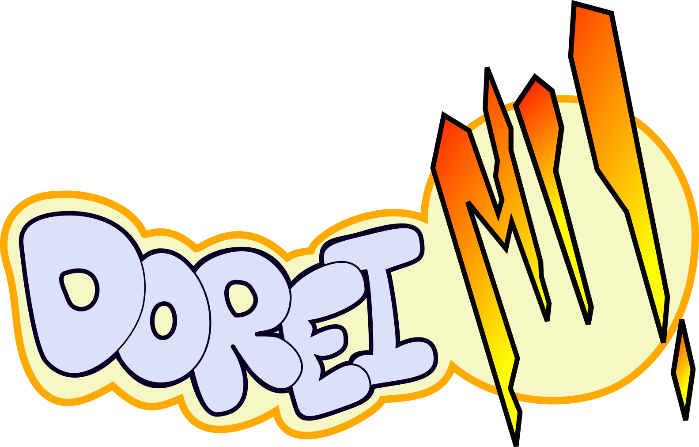

---

<table id="table1">
<tr><td>Titre</td><td>Dorei Mi !</td></tr>
<tr><td>Developpeurs</td><td>
    Florian Desrousseaux 
    François Duport 
    Marion Pellicer 
    Pablo Bourdelas
    </td></tr>
<tr><td>Moteur de Jeu</td><td> Unity </td></tr>
<tr><td>Date de Sortie</td><td> Inconnue </td></tr>
<tr><td>Genre</td><td> Platforme/Puzzle 2D </td></tr>
<tr><td>Mode</td><td> Un joueur </td></tr>
<tr><td>Plateforme</td><td> Windows / Unix </td></tr>
<tr><td>Media</td><td> Dématérialisé </td></tr>
<tr><td>Input</td><td> Clavier / Souris </td></tr>
</table>

### Histoire

Dans un monde où l'univers de l'animation japonaise fascine de plus en plus les gens, le Québec décide d'organiser le Cosmic Nihon Festival. Alors qu'elle compte se rendre là-bas en tant qu'invitée d'honneur, la jeune star de la J-pop Yhdol se retrouve perdue au milieu de la forêt québecoise après un crash d'avion. Elle va devoir se débrouiller pour se rendre à temps au festival, en sollicitant l'aide de ses nombreux fans qu'elle pourra rencontrer au cours de son périple. Yhdol rencontrera plusieurs types d'otaku : les Doh, les Rei, les Mie, les Pha, les Saul, les La et les Xi.

### Gameplay

Le joueur incarne Yhdol et peut se déplacer en marchant et sautant dans le décor (tableau en 2D). Des énigmes bloquent son chemin, et il doit les résoudre à l'aide des otakus.
Le gameplay repose sur l'utilisation des différentes capacités de chaque type d'otaku.

*Exemple les otakus Pha seraient forts, les Saul grands,
les Rei pourraient couper des choses, etc.*

Dorei Mi ! est un jeu basé sur la résolution d'énigmes plus ou moins complexes dans un univers très nippon. Pour réussir à passer les différents niveaux du jeu, le joueur devra être capable de s'adapter à la situation. En effet, le jeu demande de changer régulièrement sa façon de voir le problème et de le résoudre. On distingue deux grandes approches - que l'on peut voir comme des phases - du jeu.

Tout d'abord, nous avons les phases dites de "voyage", lors de ces phases le joueur contrôle un petit nombre d'otakus. Les décors sont plus "exotiques", on découvre des paysages en background. Les otakus mis à disposition ne sont pas très nombreux, il faut savoir les utiliser intelligement si on veut pouvoir accéder à la suite.

*Exemple 1 : un niveaux basique avec des caisses qui bloque le passage, le joueur devrait alors utiliser des otakus forts pour libérer le passage.*

*Exemple 2 : Le joueur utilise un otaku fort pour propulser dans les airs un otaku connaissant l'art de la coupe, pour sectionner une corde ce qui permet d'abaisser un pont*

Ensuite, nous avons les phases dites de "concert", où le joueur contrôle de nombreux otakus. Les décors sont plus ruraux, on se retrouve au milieu d'une ville, ou dans un endroit clos, l'ambiance est très différente de celle instaurée au cours des voyages. Ce changement de décor et de moyens mis à disposition implique forcément un changement dans le gameplay, les énigmes sont pensées différement afin que le joueur n'entre pas dans une routine de résolution et ne se lasse pas du jeu.

### Feedback

L'utilisation des otakus se ferait avec un retour audio, en fonction de leur type, ce qui permettrait d'introduire un côté musical aux énigmes, en créant des enchaînements de notes, pour créer des mélodies.

*Exemple : lorsqu'un otaku Pha utilise sa force, la note Fa est jouée*

La sélection des différents otakus pourra être marquée par un changement des couleurs utilisées pour les représenter. Par exemple, un otaku dont l'utilisation n'a pas encore été faite paraîtra avec des couleurs pastels tandis qu'un autre déjà placé sur le terrain se verra affiché avec des couleurs plus vives. Ce changement de couleur parait dès que l'otaku est placé et celui-ci repasse au pastel si le joueur décide de supprimer la sélection qu'il a fait. On peut rajouter à cela que la sélection du joueur est marquée par un léger grossissement des éléments sélectionnés.

### Bonus

Des stages bonus seront également disponibles tout au long de l'aventure. Nous pourrons les débloquer après avoir complété d'autres niveaux en accomplissant des succès comme réussir une extraction d'un niveau en un temps donné ou encore en limitant le nombre d'otaku qu'il faudra utiliser pour s'en sortir. Il y aura aussi d'autres stages bonus plus "épiques" ceux-là pourront être directement intégrés à la phase de gameplay normale du joueur qui pourra y accéder en atteignant une zone de la carte qui était cachée.

### Inspiration

Le jeu s'inspire de Pikmin (Nintendo-2001). Il reprend les multiples catégories à capacité différentes ainsi que l'aspect "aventure". Le jeu differt par sa vue 2D de côté et l'ajout de l'aspect "platforme". Le jeu pourrait aussi bien être comparé à Lemmings (Psygnosis/DMA Design-1991).

Le design du personnage principal sera inspiré des vocaloids ci-dessous :

*Exemple :*

